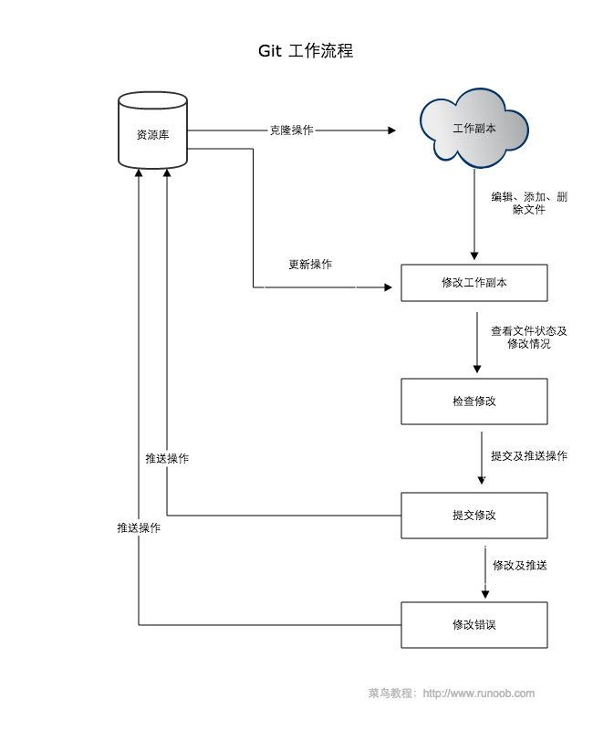

# **GIT教程**

* Git 是一个开源的分布式版本控制系统，用于敏捷高效地处理任何或小或大的项目。

* Git 是 Linus Torvalds 为了帮助管理 Linux 内核开发而开发的一个开放源码的版本控制软件。

* Git 与常用的版本控制工具 CVS, Subversion 等不同，它采用了分布式版本库的方式，不必服务器端软件支持。
***************
## **Git 与 SVN 区别**
Git 不仅仅是个版本控制系统，它也是个内容管理系统(CMS)，工作管理系统等。

如果你是一个具有使用 SVN 背景的人，你需要做一定的思想转换，来适应 Git 提供的一些概念和特征。

Git 与 SVN 区别点：

1. **Git 是分布式的，SVN 不是：** 这是 Git 和其它非分布式的版本控制系统，例如 SVN，CVS 等，最核心的区别。

2. **Git 把内容按元数据方式存储，而 SVN 是按文件：** 所有的资源控制系统都是把文件的元信息隐藏在一个类似 .svn、.cvs 等的文件夹里。

3. **Git 分支和 SVN 的分支不同：** 分支在 SVN 中一点都不特别，其实它就是版本库中的另外一个目录。

4. **Git 没有一个全局的版本号，而 SVN 有：** 目前为止这是跟 SVN 相比 Git 缺少的最大的一个特征。

5. **Git 的内容完整性要优于 SVN：** Git 的内容存储使用的是 SHA-1 哈希算法。这能确保代码内容的完整性，确保在遇到磁盘故障和网络问题时降低对版本库的破坏。

*************
## **Git 快速入门**
本站也提供了 Git 快速入门版本，你可以点击 [Git 简明指南](https://www.runoob.com/manual/git-guide/) 查看。

入门后建议通过本站详细学习Git 教程。

Git 完整命令手册地址：http://git-scm.com/docs

PDF 版命令手册：[github-git-cheat-sheet.pdf](https://www.runoob.com/manual/github-git-cheat-sheet.pdf)
***
# **Git工作流程**
本章节我们将为大家介绍 Git 的工作流程。

一般工作流程如下：

* 克隆 Git 资源作为工作目录。
* 在克隆的资源上添加或修改文件。
* 如果其他人修改了，你可以更新资源。
* 在提交前查看修改。
* 提交修改。
* 在修改完成后，如果发现错误，可以撤回提交并再次修改并提交。

下图展示了 Git 的工作流程：

***
# **Git 工作区、暂存区和版本库**
## 基本概念
**我们先来理解下Git 工作区、暂存区和版本库概念**

>* 工作区：就是你在电脑里能看到的目录。
>* 暂存区：英文叫stage, 或index。一般存放在 ".git目录下" 下的index文件（.git/index）中，所以我们把暂存区有时也叫作索引（index）。
>* 版本库：工作区有一个隐藏目录.git，这个不算工作区，而是Git的版本库。

**下面这个图展示了工作区、版本库中的暂存区和版本库之间的关系：**

图中左侧为工作区，右侧为版本库。在版本库中标记为 "index" 的区域是暂存区（stage, index），标记为 "master" 的是 master 分支所代表的目录树。

图中我们可以看出此时 "HEAD" 实际是指向 master 分支的一个"游标"。所以图示的命令中出现 HEAD 的地方可以用 master 来替换。

图中的 objects 标识的区域为 Git 的对象库，实际位于 ".git/objects" 目录下，里面包含了创建的各种对象及内容。

当对工作区修改（或新增）的文件执行 "git add" 命令时，暂存区的目录树被更新，同时工作区修改（或新增）的文件内容被写入到对象库中的一个新的对象中，而该对象的ID被记录在暂存区的文件索引中。

当执行提交操作（git commit）时，暂存区的目录树写到版本库（对象库）中，master 分支会做相应的更新。即 master 指向的目录树就是提交时暂存区的目录树。

当执行 "git reset HEAD" 命令时，暂存区的目录树会被重写，被 master 分支指向的目录树所替换，但是工作区不受影响。

当执行 "git rm --cached <file>" 命令时，会直接从暂存区删除文件，工作区则不做出改变。

当执行 "git checkout ." 或者 "git checkout -- <file>" 命令时，会用暂存区全部或指定的文件替换工作区的文件。这个操作很危险，会清除工作区中未添加到暂存区的改动。

当执行 "git checkout HEAD ." 或者 "git checkout HEAD <file>" 命令时，会用 HEAD 指向的 master 分支中的全部或者部分文件替换暂存区和以及工作区中的文件。这个命令也是极具危险性的，因为不但会清除工作区中未提交的改动，也会清除暂存区中未提交的改动。

***
# **Git创建仓库**
本章节我们将为大家介绍如何创建一个 Git 仓库。

你可以使用一个已经存在的目录作为Git仓库。

## git init
Git 使用 **git init** 命令来初始化一个 Git 仓库，Git 的很多命令都需要在 Git 的仓库中运行，所以 **git init** 是使用 Git 的第一个命令。

在执行完成 **git init** 命令后，Git 仓库会生成一个 .git 目录，该目录包含了资源的所有元数据，其他的项目目录保持不变（不像 SVN 会在每个子目录生成 .svn 目录，Git 只在仓库的根目录生成 .git 目录）。

### 使用方法
使用当前目录作为Git仓库，我们只需使它初始化。

### git init

该命令执行完后会在当前目录生成一个 .git 目录。

使用我们指定目录作为Git仓库。

### git init newrepo
初始化后，会在 newrepo 目录下会出现一个名为 .git 的目录，所有 Git 需要的数据和资源都存放在这个目录中。

如果当前目录下有几个文件想要纳入版本控制，需要先用 git add 命令告诉 Git 开始对这些文件进行跟踪，然后提交：

* $ git add *.c
* $ git add README
* $ git commit -m '初始化项目版本'
以上命令将目录下以 .c 结尾及 README 文件提交到仓库中。

## git clone
我们使用 git clone 从现有 Git 仓库中拷贝项目（类似 svn checkout）。

克隆仓库的命令格式为：

### git clone <repo>
如果我们需要克隆到指定的目录，可以使用以下命令格式：

### git clone <repo> <directory>
参数说明：
* repo:Git 仓库。
* directory:本地目录。
* 比如，要克隆 Ruby 语言的 Git 代码仓库 Grit，可以用下面的命令：

### $ git clone git://github.com/schacon/grit.git
执行该命令后，会在当前目录下创建一个名为grit的目录，其中包含一个 .git 的目录，用于保存下载下来的所有版本记录。

如果要自己定义要新建的项目目录名称，可以在上面的命令末尾指定新的名字：
### $ git clone git://github.com/schacon/grit.git mygrit

